# 接入鼠标禁用触控板（Enable mouse connection while disabling the touchpad）（保姆级教程）

## 可能遇见的问题

### 问题一：无法加载文件

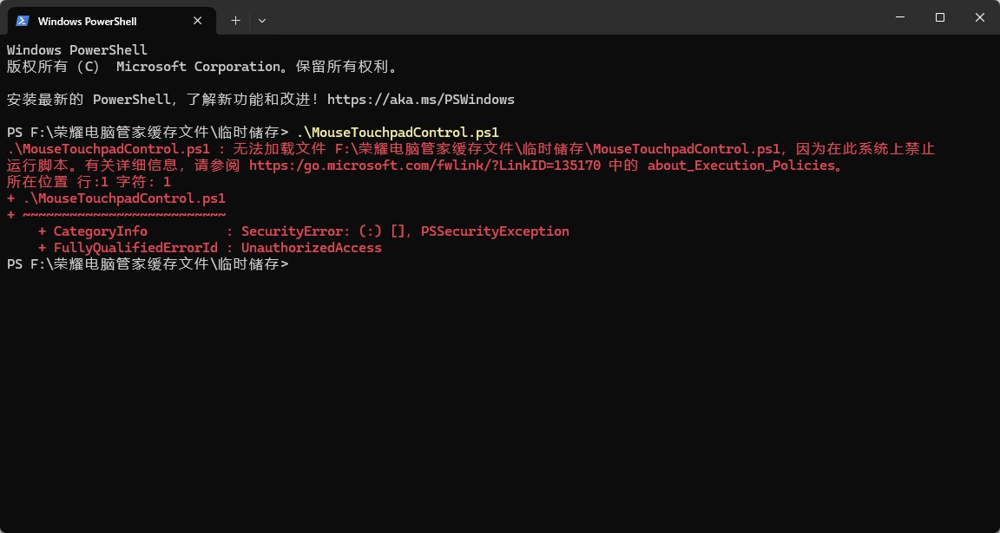

1.临时解决

当前的管理员 PowerShell 窗口中，先执行这条命令：

```
Set-ExecutionPolicy Bypass -Scope Process
```

然后再运行你的脚本：

```
.\MouseTouchpadControl.ps1
```

2. 永久解决（以后所有脚本都能正常运行-->以管理员身份打开 PowerShell。

```
执行：Set-ExecutionPolicy RemoteSigned
```

### 问题二：txt记事本不显示下划线

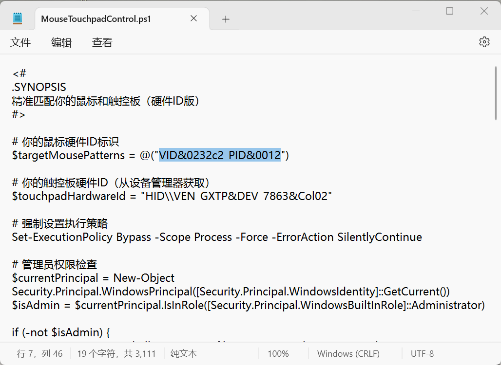

1.解决方案

将记事本的字体修改为12号即可解决

操作如下：{设置（**⚙️**->字体->大小）将大小设置为12号}此操作适用于win11系统

win10系统显示下划线（我的电脑是显示的），无需设置

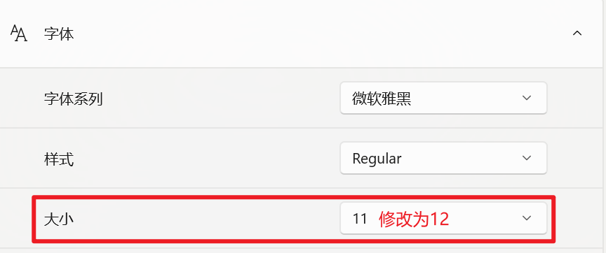

## 如何运行

### 第一步：查询鼠标和触控板对应的UID

操作如下：

1.1鼠标查询：此电脑（右键）->{显示更多选项（win11才有的操作）}->管理->设备管理器->鼠标和其他指针设备

1.2触控板查询：此电脑（右键）->{显示更多选项（win11才有的操作）}->管理->设备管理器->人体学输入设备

2.1禁用设备（判断你的鼠标和键盘属于哪个设备）

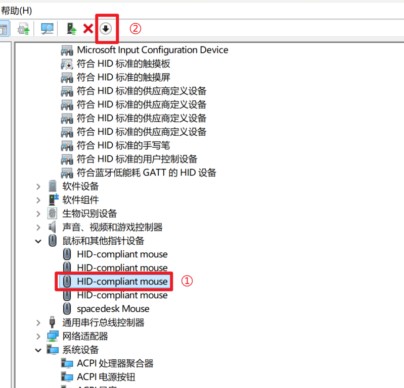

禁用后，鼠标不能使用，表示禁用成功，当前设备属于该鼠标（同理，触控板和鼠标的操作一样，这里就不展示了）

**注意：禁用后请启用该设备，避免影响其他设备使用，如需启动，在点击上方图片的②即可启动**

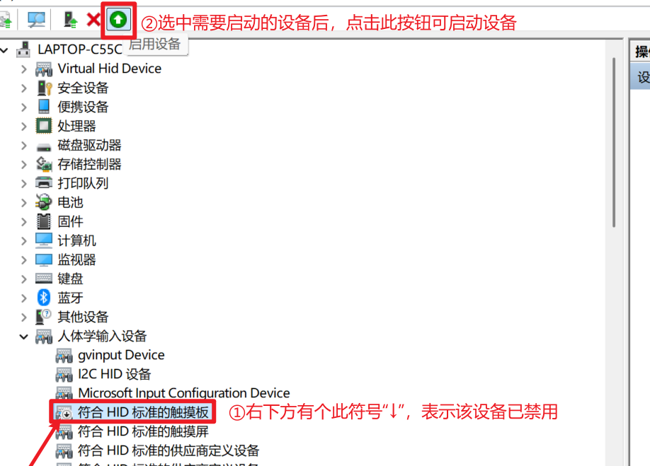

3.1查询设备的UID（身份信息）

选中设备（右键）->属性->详细信息->属性->硬件ID

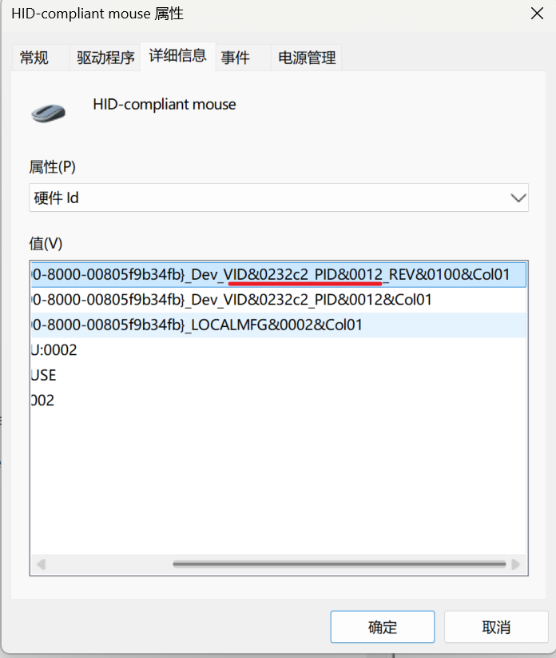

### 第二步：修改代码

打开 MouseTouchpadControl.ps1 此文件

替换代码中的UID，改成属于你们自己设备的UID（注意不要填写错了，鼠标和触控板的UID，需要对应，代码也别放错位置了

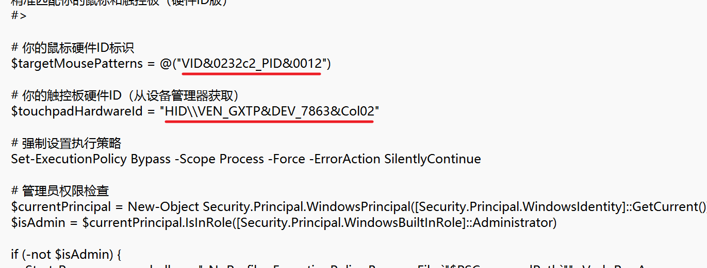

**备注：如果UID里面有\\ 请打 \\\,比如上方的触控板硬件ID就是此情况        **

### 第三步：试运行你的代码，看有没有写正确

1.1 打开powershell(需要管理员身份运行)

1.2 输入你的文件保存的路径（路径必须是全英文）

``````
cd '路径'
例如：cd 'D:\HONORDOWNLOAD\Enable mouse connection while disabling the touchpad'
``````

1.3看见此内容就表示进入成功

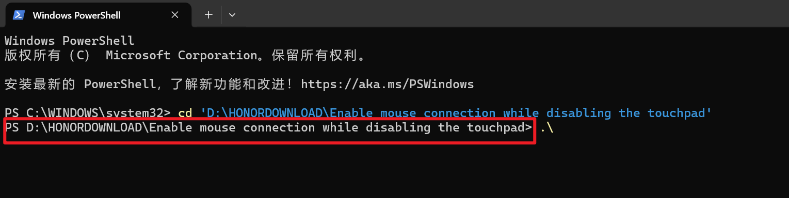

1.4运行该程序

``````
.\MouseTouchpadControl.ps1
``````

如果有报错，请看此页面的最顶部《可能遇到的问题》的问题一

弹出此对话框并且有显示HID-compliant mouse和Disable touchpad（表示读取成功）{我的是这个名称，你们的不一定是这个名词}

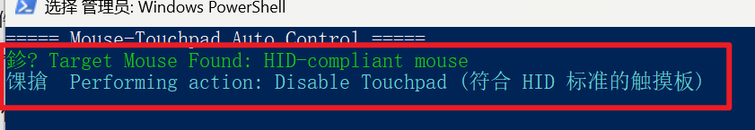

## 设置开机自动启动{即自动运行程序}

Q：为什么要设置开机自启动呢？我手动点击不好吗？

A：这是为了避免出差或者忘记带鼠标，触控板又被禁用无法使用的时候，提供的方案。


1.1打开 MouseTouchpadAutoStart.bat 选择用记事本打开此文件

2.1替换路径，将下方画横线的路径，替换为你们电脑自己的路径（路径必须是全英文否则无法会报错

我自己的路径解说：

``````
路径：D:\HONORDOWNLOAD\Enable mouse connection while disabling the touchpad
文件名称：MouseTouchpadControl.ps1
所以我填写的路径名词就是："D:\HONORDOWNLOAD\Enable mouse connection while disabling the touchpad\MouseTouchpadControl.ps1"
``````

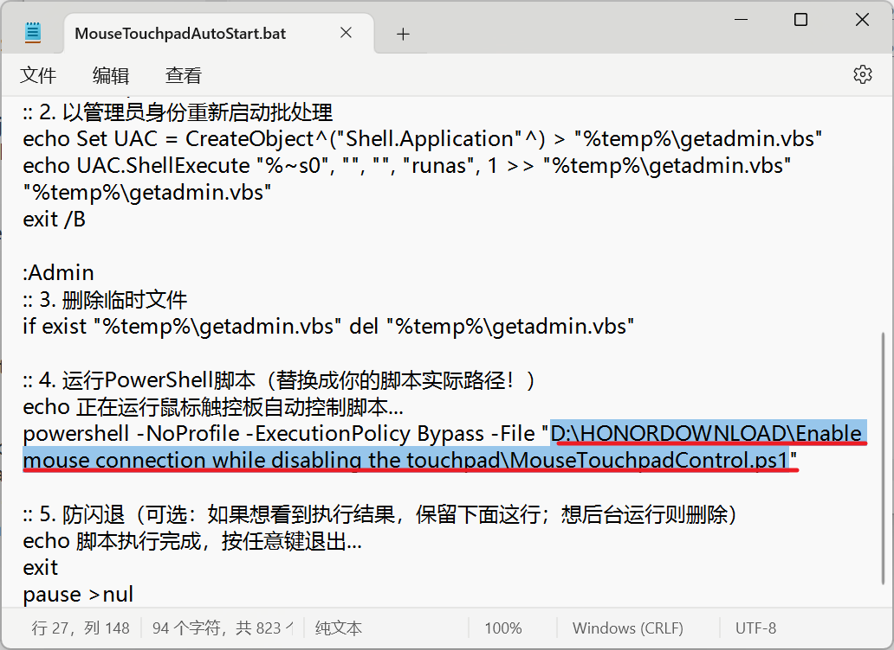

3.1 双击运行 MouseTouchpadAutoStart.bat 看是否成功运行

4.1自启动运行

4.1.1此电脑（右键）->{显示更多选项（win11才有的操作）}->管理->任务计划程序->创建基本任务

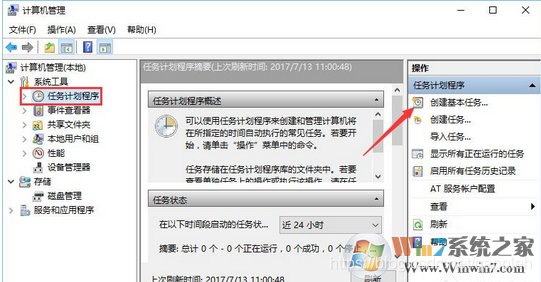

4.1.2 这个时候就需要你写一些名字啊，描述啊什么的，可以随便填一填，然后下一步。

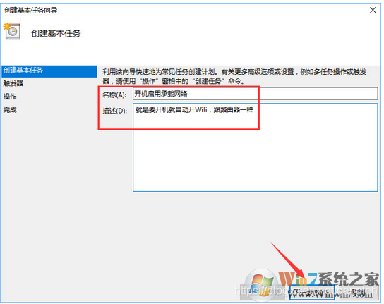

4.1.3 这个时候要选择什么时候触发，可以选择什么时候开始执行。我这里选择的是用户登录时，就是开机，输入密码登录后就执行，然后下一步。

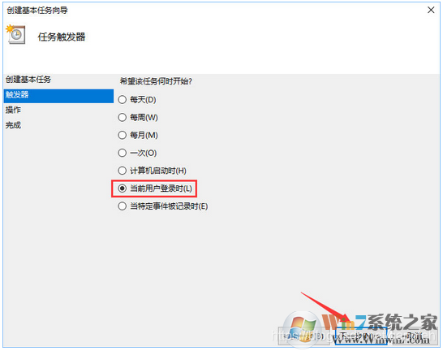

4.1.4 选择一个操作，我这里选择启动程序，然后选择一个批处理，因为我们的批处理不用传参，可选参数就不管了，直接下一步。

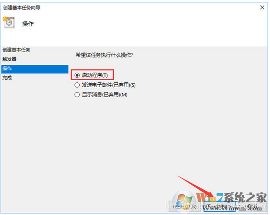

4.1.5选择浏览，找到刚刚 MouseTouchpadAutoStart.bat 这个文件存放的路径，选择此文件

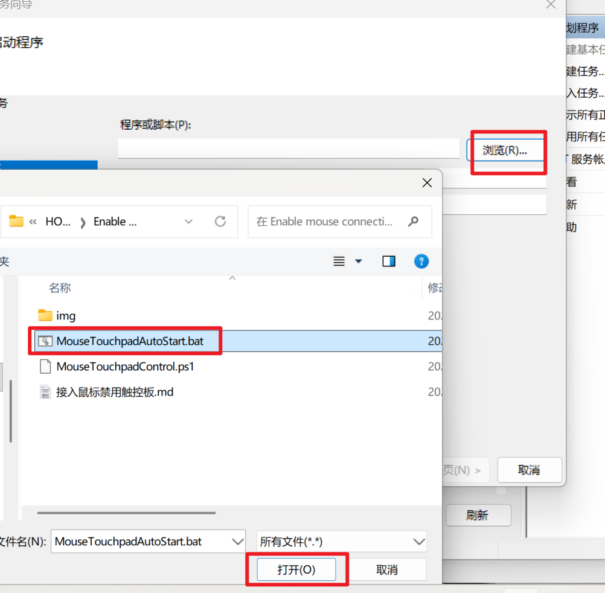

4.1.6然后就完成啦，可以试试，开机的时候，会不会自启动;如果开机的时候有弹出对话框，让你选择是否用管理员身份运行，每次点击是，感觉有点麻烦，可以看看4.2操作。

4.2此电脑（右键）->{显示更多选项（win11才有的操作）}->管理->任务计划程序->任务计划程序库

4.2.1找到你在4.1.2命名的名称双击它

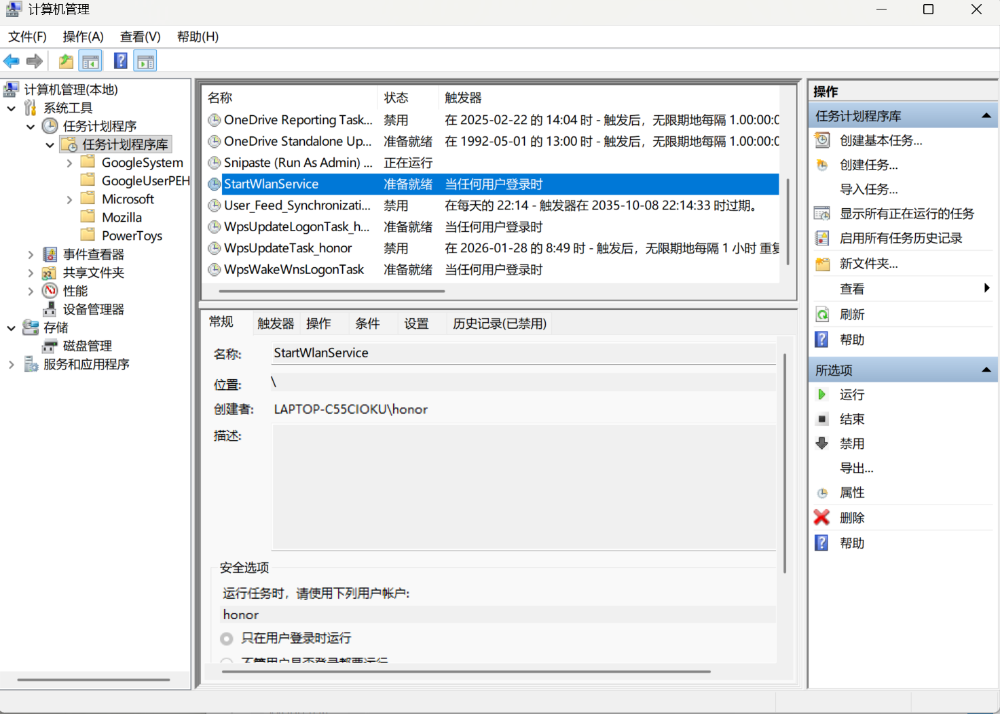

4.2.2 勾选使用最高权限运行即可

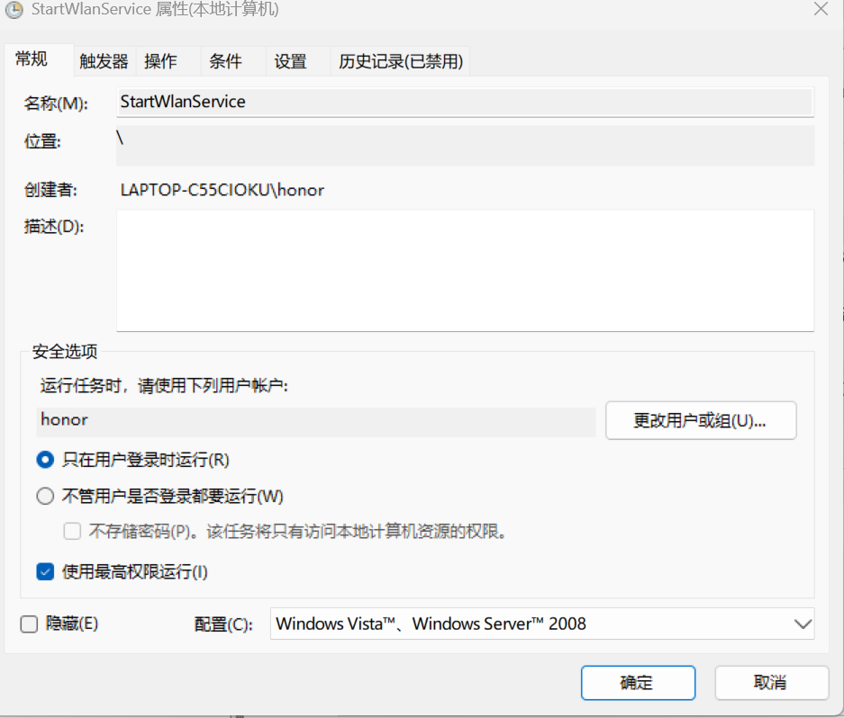

## 小彩蛋

Q：这个的工作原理是怎么回事呢，我咋有点不明白呢？可以说说吗？

A：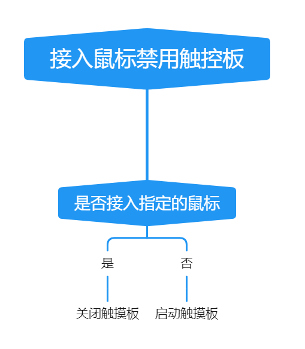

感谢各位的观看，如果有什么不懂的地方或者意见，欢迎各位大神来交流。

视频链接：[鼠标禁用触控板操作指南（保姆级教程） 如何自动禁用触控板？ #触摸板 #鼠标#电脑知识 #实用干货 #软件分享实用教程 - 抖音](https://www.douyin.com/video/7600601765406362934)

QQ：1342315686

